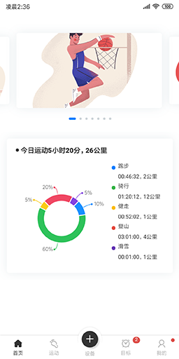
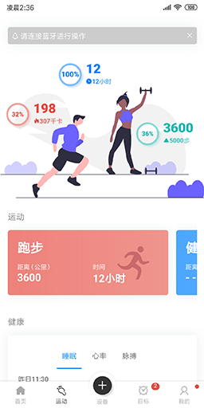
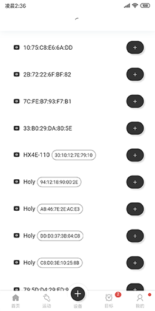
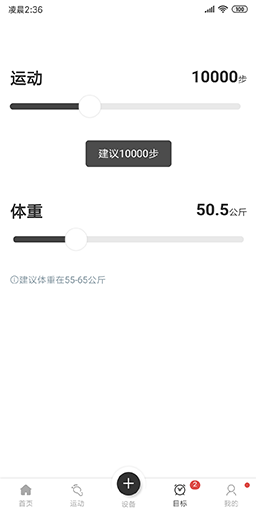
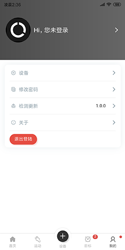
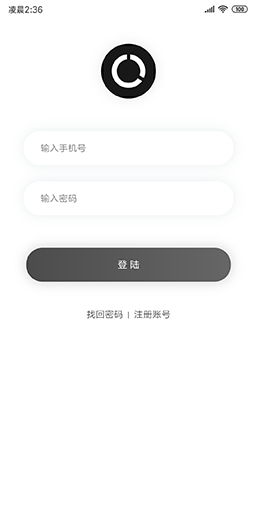
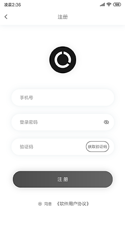
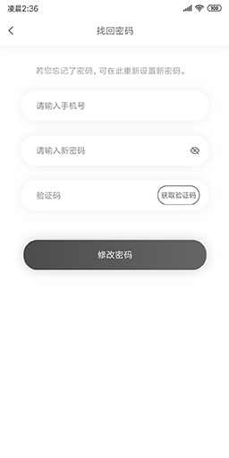

#  智能手表演示  

[](https://github.com/vuejs/vue)
[](https://github.com/dcloudio/uni-app)
[](https://github.com/weilanwl/ColorUI)
[](http://www.dcloud.io/hbuilderx.html)

## 概述  

> 🏃‍⌚  
> 智能手表运动相关的App页面展示。  
> 该项目是用于模型演示，并没有写入实际功能。  
> 主要用于学习参考，商业用途需经作者允许。  
> [](https://icons8.cn/ouch/style/pale)
> [](https://undraw.co/search)  
  
| 测试平台 | 是否支持 | 下载演示 |  
|------|------|------|  
| Chrome | ✔ | 无 |  
| Android`8.0` | ✔ | [下载](https://github.com/AmosHuKe/Watch-Test/releases) |  
| ios`未测试` | 理论可行 | 无 |  
  
## 目录结构  
```
├── App.vue    //应用配置（配置App全局样式以及监听等）  
├── main.js    //Vue初始化入口文件  
├── manifest.json    //配置应用名称、appid、logo、版本等打包信息
├── pages.json   //配置页面路由、导航条、选项卡等页面类信息
├── common    //共用文件
├── components    //组件文件
├── pages    //页面文件夹  
│   └── index.vue    //主布局页
│   └── home    //首页
│   │   ├── children  //首页子
│   │   ├── home.vue   //首页
│   └── motion    //运动
│   │   ├── children  //运动页子
│   │   ├── motion.vue   //运动页
│   └── ble    //设备（蓝牙）
│   │   ├── children  //设备（蓝牙）页子
│   │   ├── ble.vue   //设备（蓝牙）页
│   └── goal    //目标
│   │   ├── children  //目标页子
│   │   ├── goal.vue   //目标页
│   └── mine    //我的
│   │   ├── children  //我的页子
│   │   ├── mine.vue   //我的页
├── lib    //第三方库/框架  
│   └── colorui    //ColorUi
├── style    //样式文件  
├── static    //静态文件  
├── appstatic    //APP静态文件（Icon，启动图...）
├── unpackage    //打包后文件（dist）  
├── demo    //演示预览文件  

```

## 预览 `点击查看大图`  
> 首页  

[](./demo/1.png)  

> 运动  

[](./demo/2.png)  

> 设备（蓝牙）  

[](./demo/3.png)  

> 目标  

[](./demo/4.png)  

> 我的  

[](./demo/5.png)  

> 登陆  

[](./demo/6.png)  

> 注册  

[](./demo/7.png)  

> 找回密码  

[](./demo/8.png)  
