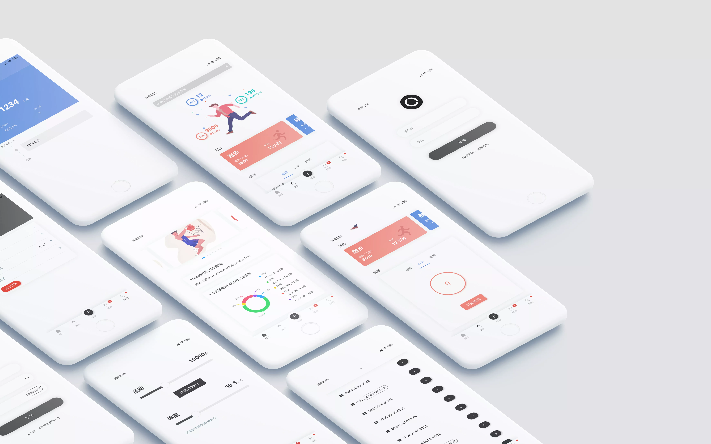

#  运动手表演示  


[](https://github.com/vuejs/vue)
[](https://github.com/dcloudio/uni-app)
[](https://github.com/weilanwl/ColorUI)
[](https://www.ucharts.cn/)
[](http://www.dcloud.io/hbuilderx.html)  
 

[](./demo/watch_1080.jpg?raw=true)


## 📕 简介

🏃‍⌚ 主要用于参考并无实际功能 ！！！  
智能手表运动相关的页面展示 Demo。     

> 登录账号：admin 密码：admin    
>   
> Vue2.0 + Uni-App + Vuex + ColorUI + uCharts + Scss  


| 测试平台 | 是否支持 |  
|------|------|  
| 微信小程序 | ✔ |  
| Android | ✔ |  
| ios `未测试` | 未测试 |  


## 🛠️ 启动前必备环境

### 🛠️ APP 模块权限配置（manifest.json）

| APP模块 | 是否使用 |  
|------|------|  
| `Bluetooth(低功耗蓝牙)` | ✔ |   

### 🛠️ 插件

项目需开启 `Scss`（HBuilderX v3.8.7 > 工具 > 插件安装 > Scss）

### 🛠️ 本地数据服务

首先要启动 json-server，以便数据请求。

```
# 全局安装 json-server
$ npm install -g json-server

# 在项目根目录下运行 json-server
$ json-server --watch mock/db.json
```


## 📑 项目结构

```
├── App.vue             // 应用配置（配置App全局样式以及监听等）  
├── main.js             // Vue初始化入口文件  
├── manifest.json       // 配置应用名称、appid、logo、版本等打包信息
├── pages.json          // 配置页面路由、导航条、选项卡等页面类信息
├── mock                // 模拟数据
├── common              // 共用文件
├── components          // 组件文件
├── pages               // 页面文件夹  
│   └── index.vue       // 主布局页
│   └── home            // 首页
│   │   ├── children    // 首页子
│   │   ├── home.vue    // 首页
│   └── motion          // 运动
│   │   ├── children    // 运动页子
│   │   ├── motion.vue  // 运动页
│   └── ble             // 设备（蓝牙）
│   │   ├── children    // 设备（蓝牙）页子
│   │   ├── ble.vue     // 设备（蓝牙）页
│   └── goal            // 目标
│   │   ├── children    // 目标页子
│   │   ├── goal.vue    // 目标页
│   └── mine            // 我的
│   │   ├── children    // 我的页子
│   │   ├── mine.vue    // 我的页
├── lib                 // 第三方库/框架  
│   └── colorui         // ColorUi
├── service             // 服务请求相关
│   └── api             // api接口
│   └── request         // 请求全局配置，请求拦截
├── style               // 样式文件  
├── static              // 静态文件  
├── appstatic           // APP静态文件（Icon，启动图...）
├── unpackage           // 打包后文件（dist）  
├── demo                // 演示预览文件  
│   └── amos-login      // 登录模板(http://ext.dcloud.net.cn/plugin?id=538)

```


## ❓ 常见问题  

### **Q: APP 无法请求本地服务数据**  
<details>
<summary>点击展开</summary>

在确保本地 json-server 服务启动的情况下，
检查一下服务端口是否一致（默认端口为 3000）。

如果是 Android 模拟器，需要修改默认请求地址为：10.0.2.2 或者本地 IP 地址。

> 位置：service/request/index.js 内的默认请求地址

</details>

## 🖼️ Illustration

[](https://icons8.com/illustrations/style--pale)
[](https://undraw.co/) 


## 🎯 感谢开源

[ColorUI-UniApp](http://ext.dcloud.net.cn/plugin?id=239)  
[uCharts](http://ext.dcloud.net.cn/plugin?id=271)  
[luch-request](http://ext.dcloud.net.cn/plugin?id=392)  
[区间选择滑块组件](http://ext.dcloud.net.cn/plugin?id=106)  


© AmosHuKe. All Rights Reserved.
